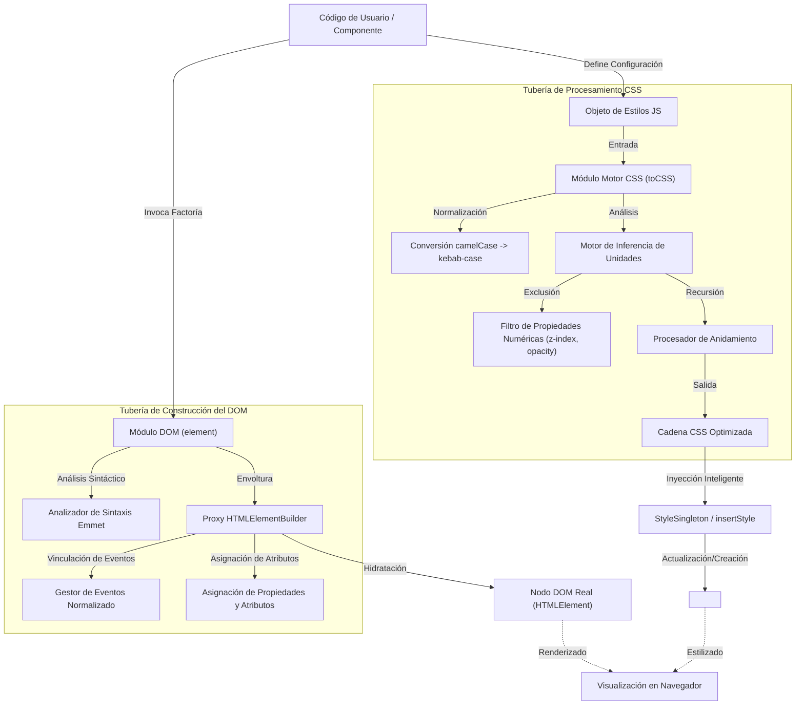
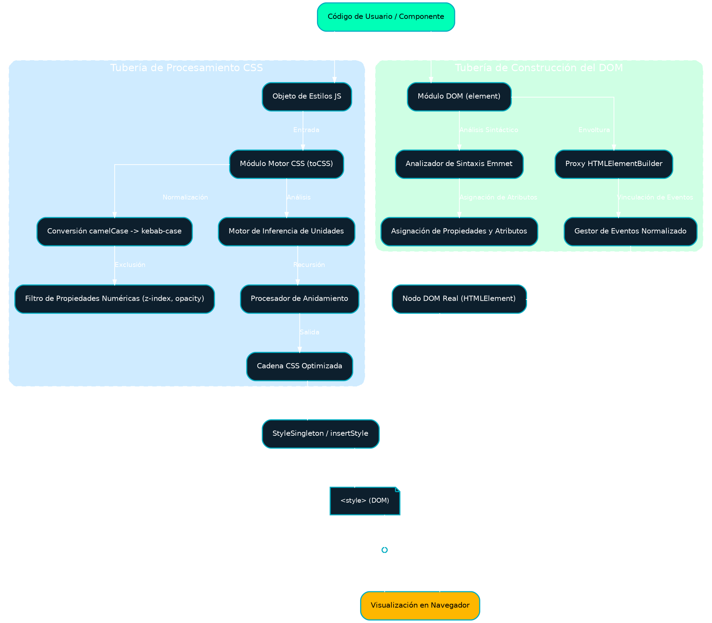

# Fluid UI Library - Compendio Técnico y Referencia Avanzada

[Contenido](doc/md/_sidebar.md ':include')

## 1. Introducción y Fundamentos Arquitectónicos

Se establece por medio del presente documento que **Fluid UI** no debe ser conceptualizada meramente como un instrumento adicional para la manipulación del Modelo de Objetos del Documento (DOM); por el contrario, constituye una solución de ingeniería concebida para suprimir la disparidad existente entre el rendimiento de la ejecución nativa de JavaScript y la ergonomía inherente a las bibliotecas declarativas contemporáneas. Desarrollada bajo el estricto tipado de **TypeScript**, Fluid UI propone un enfoque de alto rendimiento para la construcción de interfaces, eliminando la sobrecarga computacional derivada del DOM Virtual mediante una manipulación directa y eficiente, preservando, de manera concomitante, una sintaxis expresiva y segura.

La arquitectura subyacente se erige sobre dos pilares fundamentales, a saber:

1. **El Patrón Constructor (Builder Pattern):** Mecanismo que faculta la composición de elementos HTML mediante una metodología fluida y encadenable, optimizando la legibilidad y mitigando la verbosidad característica de la invocación `document.createElement`.
2. **Motor de Inferencia de Estilos en Tiempo de Ejecución (CSS-in-JS Runtime):** Un compilador que opera en tiempo de ejecución, transformando objetos JavaScript en Hojas de Estilo en Cascada (CSS) válidas, gestionando de forma automatizada unidades, prefijos y variables, lo cual viabiliza la implementación de un sistema de diseño dinámico.

### Representación Gráfica de la Arquitectura de Alto Nivel

El diagrama subsiguiente detalla no solo la interacción entre componentes, sino el flujo de datos y las transformaciones que se suscitan desde el instante en que la función es invocada por el desarrollador hasta la renderización final por parte del navegador.

### Representación en Graphviz (DOT):

### Principios de Diseño Extendidos

* **Interfaz Fluida y Encadenamiento de Métodos:** La Interfaz de Programación de Aplicaciones (API) ha sido diseñada de tal suerte que el código resultante posea una legibilidad similar a la del lenguaje natural. Cada método modificador retorna la instancia del constructor (`this`), permitiendo configuraciones complejas (identificadores, clases, estilos, eventos) en una única expresión continua.
* **Seguridad de Tipos e Intellisense:** Mediante el aprovechamiento del sistema de tipos de TypeScript, la biblioteca expone interfaces estrictas (`HTMLElementBuilder`, `CSSStyleDeclaration`) que previenen errores comunes, tales como imprecisiones tipográficas en la denominación de eventos o propiedades CSS inválidas, con anterioridad al tiempo de ejecución.
* **Inferencia de Unidades (Inferencia Heurística):** Con el objeto de agilizar el desarrollo, la biblioteca asume de manera inteligente las intenciones del desarrollador. Un valor de `padding: 20` es compilado a `20px`, mientras que `opacity: 0.5` se mantiene como un valor escalar, basándose en una lista de exclusión de propiedades exentas de unidades.
* **Isomorfismo de Datos:** Los elementos pueden ser definidos como descriptores JSON puros (`JSONElement`), lo cual permite que la estructura de la Interfaz de Usuario sea serializable, susceptible de almacenamiento en bases de datos o transmisible vía API, para su posterior "hidratación" en el cliente.

[Motor CSS](doc/md/p-dom.md ':include')

[Helpers](doc/md/p-helpers.md ':include')

## 8. Conclusión

Se postula que Fluid UI representa un equilibrio pragmático en el desarrollo frontend moderno. Al combinar la **precisión** del tipado estático con la **flexibilidad del tiempo de ejecución**, ofrece una herramienta potente para ingenieros que requieren control total sobre el rendimiento del DOM y la especificidad del CSS. Su arquitectura modular y su dependencia mínima la convierten en la solución idónea para micro-frontends, widgets embebidos o aplicaciones de alto rendimiento donde el coste de abstracciones mayores (tales como un DOM Virtual completo) no resulta justificable.

## 10. Demostración Interactiva

La siguiente sección incorpora un marco en línea (iframe) diseñado para la previsualización directa de esta documentación técnica a través del motor de renderizado Docsify, permitiendo una experiencia de lectura interactiva y formateada.

<iframe id='traductor-frame' src='traductor.html' style='width: 100%; height: 90vh; border: none;'></iframe>
