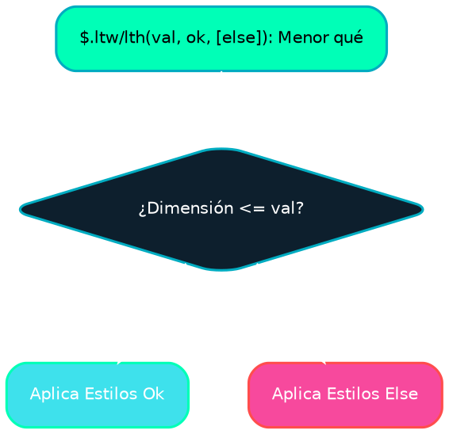
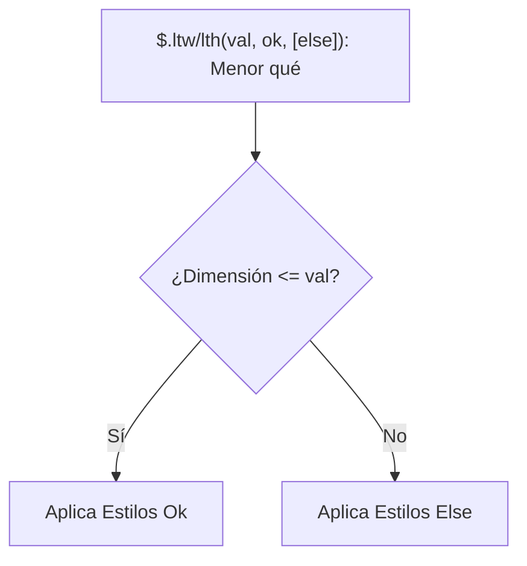
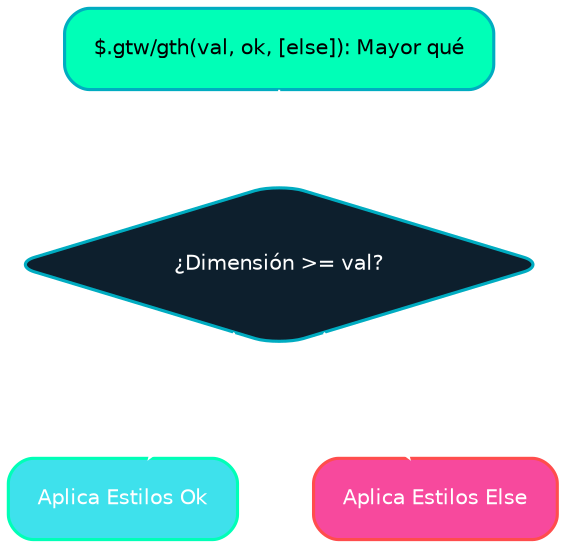
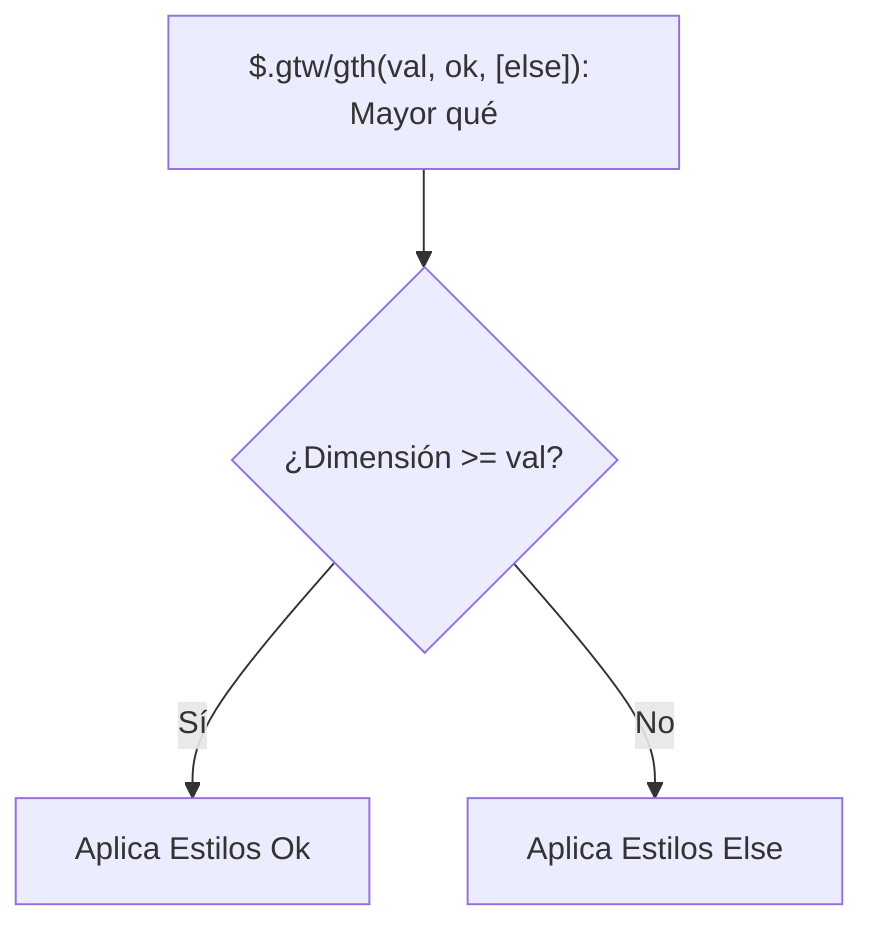
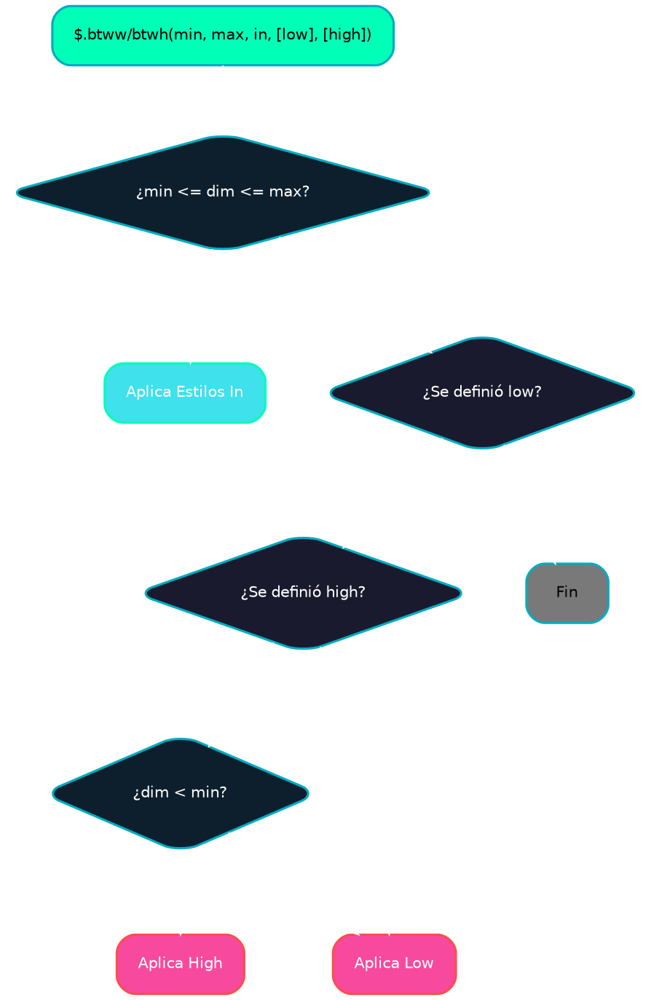
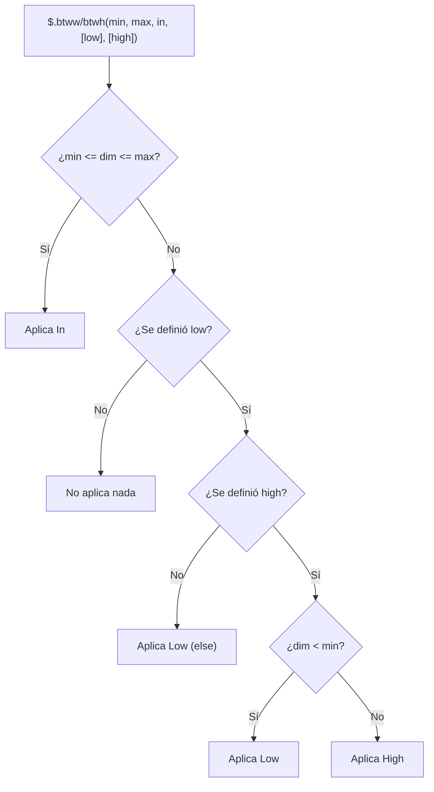
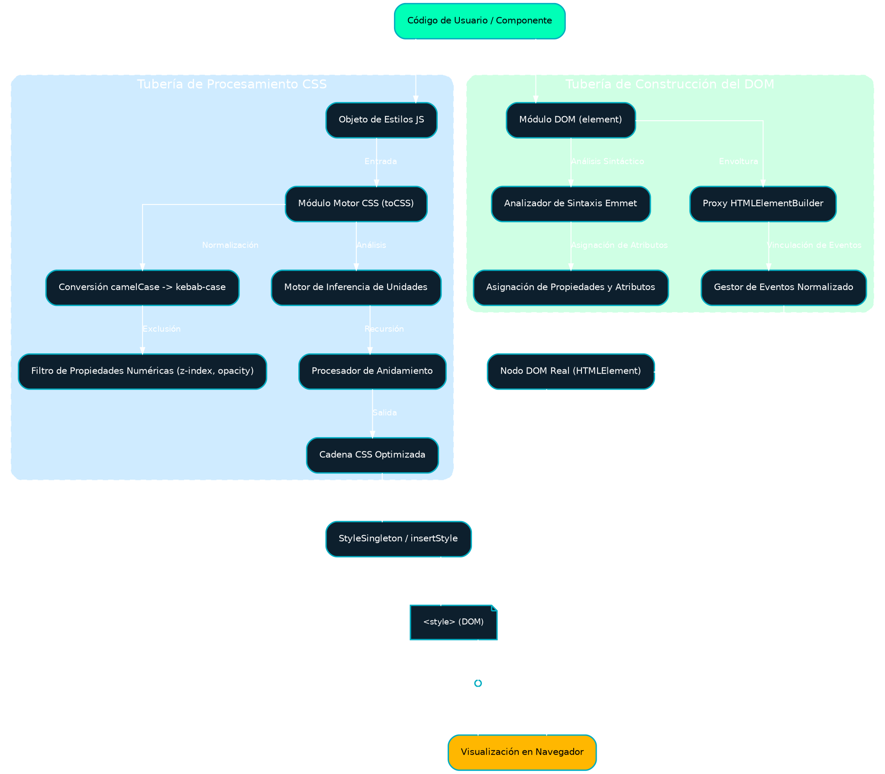
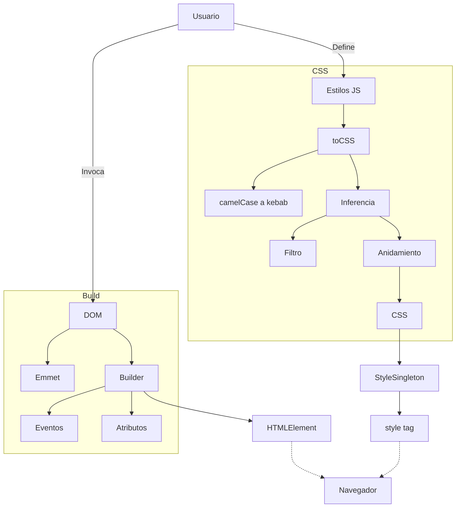

## Programación Reactiva y Media Queries

En FluidUI, las media queries no son simples cadenas de texto; son funciones de alto orden que devuelven objetos de estilos condicionales. Esto permite una arquitectura de componentes donde la lógica de respuesta vive **dentro** de la definición del estilo, no en archivos separados.

<!-- alert:{"type":"warn"} -->
Patrón "Spread" Obligatorio
<!-- alert:body -->
Dado que estas funciones retornan objetos (`{ "@media...": { ... } }`), es imperativo utilizar el operador spread (`...`) para fusionarlos correctamente con el objeto de estilos padre.
<!-- alert:end -->


<!-- tabs:start -->
<!-- tab:Menor qué | ltw() / lth() -->
<!-- details:start -->
<!-- details:summary -->
Contexto y Definiciones
<!-- details:content -->
**Lógica "Menor Qué" (<)**: Esta función evalúa si la dimensión de la pantalla es *menor o igual* al valor especificado.
*   **Sufijo `w` (ltw)**: Evalúa el **Ancho** (Width) de la ventana.
*   **Sufijo `h` (lth)**: Evalúa el **Alto** (Height) de la ventana.

Es fundamental para estrategias *Desktop-First* o para definir límites máximos.

| Variable | Significado |
| :--- | :--- |
| `val` | Valor de ruptura (Breakpoint) en px. (Ancho si es *w*, Alto si es *h*) |
| `ok` | Estilos a aplicar si: `dimensión <= val` (True) |
| `else` | Estilos a aplicar si: `dimensión > val` (False) |
<!-- details:end -->
<!-- tabs:start -->
<!-- tab:Graphviz (DOT) -->

<!-- tab:Mermaid -->

<!-- tabs:end -->
<!-- details:start:secondary -->
<!-- details:summary -->
Implementación y Equivalencia CSS
<!-- details:content -->
<!-- row -->
**Implementación JS (Fluid)**
```javascript
    $.ltw(768, c => ({backgroundColor: 'red'}), c => ({backgroundColor: 'blue'}))
```
<!-- col -->
**Equivalencia CSS**
```css
	.elemento {
		background-color: blue;
	}
	@media (max-width: 768px) {
		.elemento {
			background-color: red;
		}
	}
```
<!-- row:end -->
<!-- details:end -->
<!-- tab:Mayor qué | gtw() / gth() -->
<!-- details:start -->
<!-- details:summary -->
Contexto y Definiciones
<!-- details:content -->
**Lógica "Mayor Qué" (>)**: Esta función evalúa si la dimensión de la pantalla es *mayor o igual* al valor especificado.
*   **Sufijo `w` (gtw)**: Evalúa el **Ancho** (Width) de la ventana.
*   **Sufijo `h` (gth)**: Evalúa el **Alto** (Height) de la ventana.

Es la base de estrategias *Mobile-First* y mejora progresiva.

| Variable | Significado |
| :--- | :--- |
| `val` | Valor de ruptura (Breakpoint) en px. (Ancho si es *w*, Alto si es *h*) |
| `ok` | Estilos a aplicar si: `dimensión >= val` (True) |
| `else` | Estilos a aplicar si: `dimensión < val` (False) |
<!-- details:end -->
<!-- tabs:start -->
<!-- tab:Graphviz (DOT) -->

<!-- tab:Mermaid -->

<!-- tabs:end -->
<!-- details:start:secondary -->
<!-- details:summary -->
Implementación y Equivalencia CSS
<!-- details:content -->
<!-- row -->
**Implementación JS (Fluid)**
```javascript
    $.gtw(768, c => ({backgroundColor: 'blue'}), c => ({backgroundColor: 'red'}))
```
<!-- col -->
**Equivalencia CSS**
```css
	.elemento {
		background-color: red;
	}
	@media (min-width: 768px) {
		.elemento {
			background-color: blue;
		}
	}
```
<!-- row:end -->
<!-- details:end -->
<!-- tab:Entre | btww() / btwh() -->
<!-- details:start -->
<!-- details:summary -->
Contexto y Definiciones
<!-- details:content -->
**Lógica "Entre" (Rango)**: Evalúa si la dimensión se encuentra dentro de un rango específico [min, max].
*   **Sufijo `w` (btww)**: Evalúa el **Ancho** (Width) de la ventana.
*   **Sufijo `h` (btwh)**: Evalúa el **Alto** (Height) de la ventana.

Provee puntos de anclaje para los tres estados posibles.

| Variable | Significado |
| :--- | :--- |
| `min` | Límite inferior del rango en px. (Ancho si es *w*, Alto si es *h*) |
| `max` | Límite superior del rango en px. (Ancho si es *w*, Alto si es *h*) |
| `in` | Si `min <= dim <= max` (Dentro del rango) |
| `low` | Si `dim < min` (Por debajo del rango) |
| `high` | Si `dim > max` (Por encima del rango) |
<!-- details:end -->
<!-- tabs:start -->
<!-- tab:Graphviz (DOT) -->

<!-- tab:Mermaid -->

<!-- tabs:end -->
<!-- details:start:secondary -->
<!-- details:summary -->
Implementación y Equivalencia CSS
<!-- details:content -->
<!-- row -->
**Implementación JS (Fluid)**
```javascript
    $.btww(768, 1024, c => ({backgroundColor: 'green'}), c => ({backgroundColor: 'red'}), c => ({backgroundColor: 'blue'}))
```
<!-- col -->
**Equivalencia CSS**
```css
	.elemento {
		background-color: red;
	}
	@media (min-width: 768px) and (max-width: 1024px) {
		.elemento {
			background-color: green;
		}
	}
	@media (min-width: 1025px) {
		.elemento {
			background-color: blue;
		}
	}
```
<!-- row:end -->
<!-- details:end -->
<!-- tabs:end -->

## 1. API de Ancho (Horizontal)

| Función | Argumentos | Descripción Lógica |
| :--- | :--- | :--- |
| `$.gtw(val, ok, [else])` | `val: number`<br>`ok: Styles`<br>`else: Styles (opcional)` | **Greater Than Width.**<br>Si `width >= val` aplica `ok`.<br>Si se provee 3er arg, aplica `else` cuando `width < val`. |
| `$.ltw(val, ok, [else])` | `val: number`<br>`ok: Styles`<br>`else: Styles (opcional)` | **Less Than Width.**<br>Si `width <= val` aplica `ok`.<br>Si se provee 3er arg, aplica `else` cuando `width > val`. |
| `$.btww(min, max, in, [low], [high])` | `min, max: number`<br>`in: Styles`<br>`low, high: Styles (opt)` | **Between Widths.** La función definitiva de rangos.<br>1. `in`: Si está entre min y max.<br>2. `low`: Si es menor a min.<br>3. `high`: Si es mayor a max. |

### Caso de Uso: Lógica "If/Else"

En CSS tradicional, tendrías que escribir dos bloques `@media` separados. Con FluidUI, puedes definir ambos estados en una sola línea de función.

```javascript
    toCSS($ => ({
        ...$.gtw(800, {display: "flex", flexDirection: "row"}, {display: "block", marginBottom: "20px"})
    }))
```

## 2. API de Alto (Vertical)

Menos comunes pero vitales para interfaces sensibles a la altura (como dashboards o aplicaciones de pantalla completa). Siguen la misma lógica que las de ancho, pero sufijadas con h (Height).

<!-- row -->
<!-- card:start:{"title":{"div":{"class":"text-lg font-bold text-blue-400 mb-3","content":" $.gth(val, ...)"}},"footer":{"div":{"class":"text-xs text-slate-500 uppercase font-bold tracking-wider mt-2","content":"Greater Than Height"}}} -->
<!-- card:end -->
<!-- col -->
<!-- card:start:{"title":{"div":{"class":"text-lg font-bold text-blue-400 mb-3","content":" $.lth(val, ...)"}},"footer":{"div":{"class":"text-xs text-slate-500 uppercase font-bold tracking-wider mt-2","content":"Less Than Height"}}} -->
<!-- card:end -->
<!-- col -->
<!-- card:start:{"title":{"div":{"class":"text-lg font-bold text-blue-400 mb-3","content":" $.btwh(min, max, ...)"}},"footer":{"div":{"class":"text-xs text-slate-500 uppercase font-bold tracking-wider mt-2","content":"Between Heights"}}} -->
<!-- card:end -->
<!-- row:end -->


### Representación Gráfica de la Arquitectura de Alto Nivel

El diagrama subsiguiente detalla no solo la interacción entre componentes, sino el flujo de datos y las transformaciones que se suscitan desde el instante en que la función es invocada por el desarrollador hasta la renderización final por parte del navegador.

<!-- tabs:start -->

#### Graphviz (DOT)



#### Mermaid



<!-- tabs:end -->

### Principios de Diseño Extendidos

* **Interfaz Fluida y Encadenamiento de Métodos:** La Interfaz de Programación de Aplicaciones (API) ha sido diseñada de tal suerte que el código resultante posea una legibilidad similar a la del lenguaje natural. Cada método modificador retorna la instancia del constructor (`this`), permitiendo configuraciones complejas (identificadores, clases, estilos, eventos) en una única expresión continua.
* **Seguridad de Tipos e Intellisense:** Mediante el aprovechamiento del sistema de tipos de TypeScript, la biblioteca expone interfaces estrictas (`HTMLElementBuilder`, `CSSStyleDeclaration`) que previenen errores comunes, tales como imprecisiones tipográficas en la denominación de eventos o propiedades CSS inválidas, con anterioridad al tiempo de ejecución.
* **Inferencia de Unidades (Inferencia Heurística):** Con el objeto de agilizar el desarrollo, la biblioteca asume de manera inteligente las intenciones del desarrollador. Un valor de `padding: 20` es compilado a `20px`, mientras que `opacity: 0.5` se mantiene como un valor escalar, basándose en una lista de exclusión de propiedades exentas de unidades.
* **Isomorfismo de Datos:** Los elementos pueden ser definidos como descriptores JSON puros (`JSONElement`), lo cual permite que la estructura de la Interfaz de Usuario sea serializable, susceptible de almacenamiento en bases de datos o transmisible vía API, para su posterior "hidratación" en el cliente.