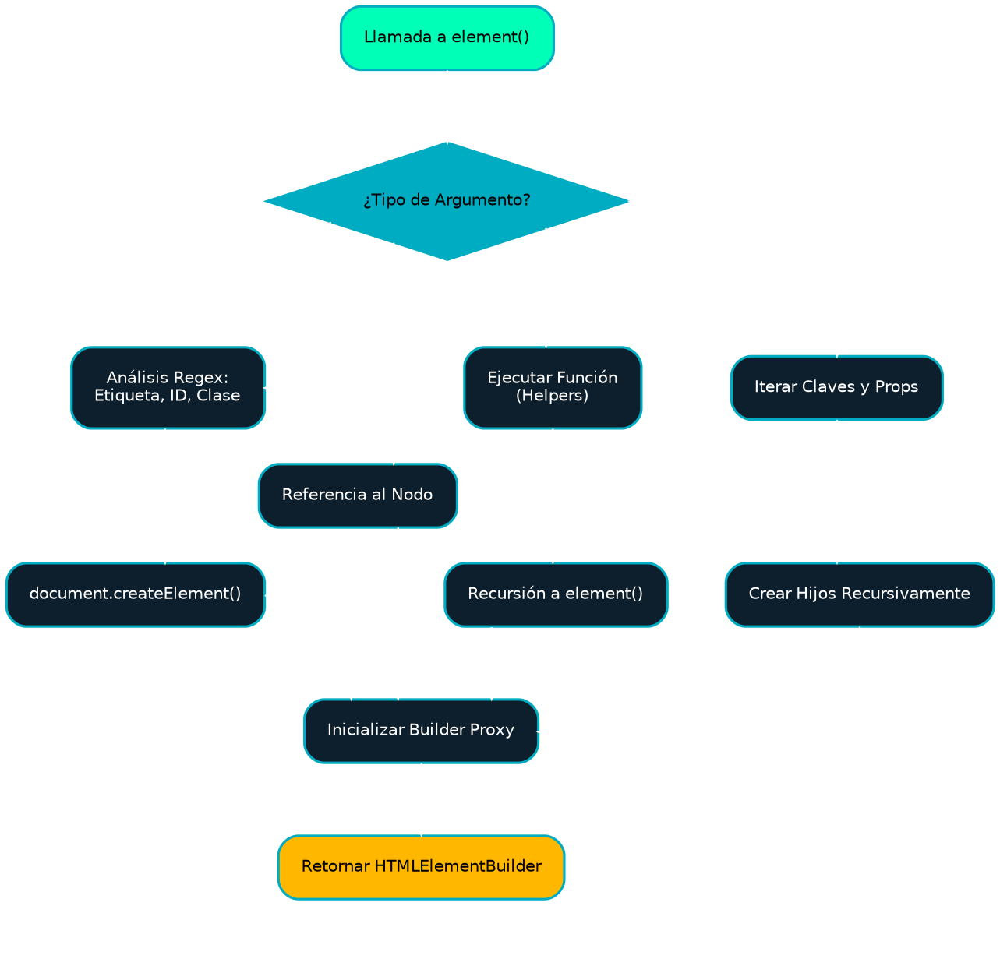
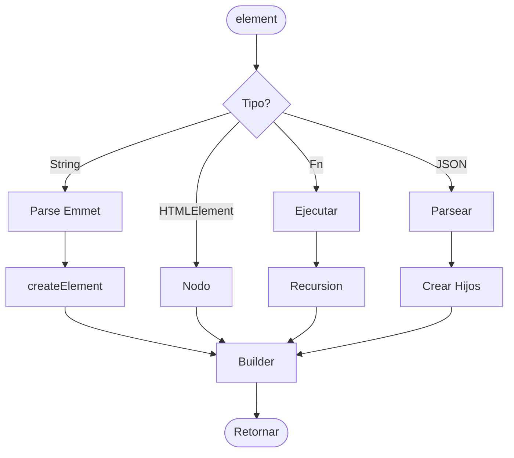
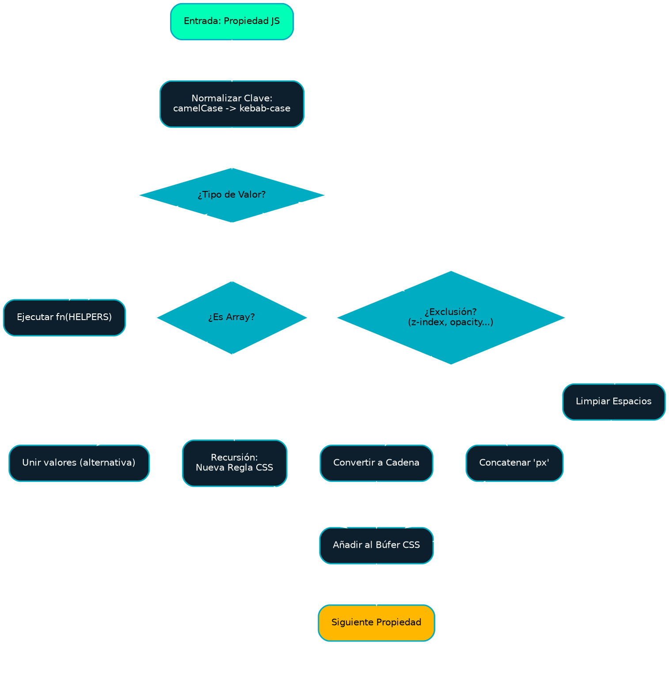
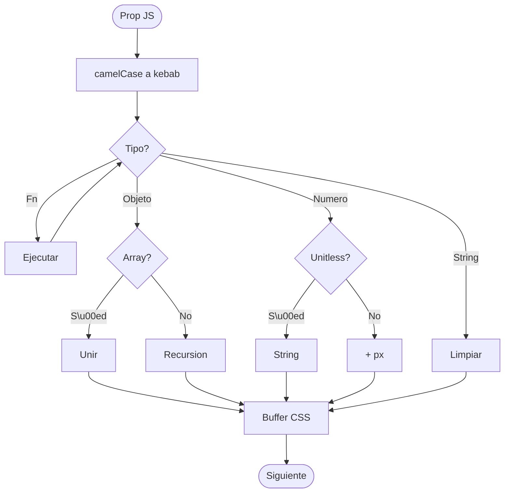

## 2. El Módulo Fundamental: Constructor DOM (dom.ts)

El módulo `dom.ts` funge como orquestador en la creación de elementos, abstrayendo la complejidad inherente a `document.createElement`, `setAttribute` y `addEventListener` tras una fachada unificada.

### 2.1. La Función Factoría element

Esta función es polimórfica y actúa como el único punto de entrada para la instanciación de la Interfaz de Usuario. Su capacidad para aceptar múltiples tipologías de argumentos le confiere una versatilidad extrema.

```typescript
    function element(target: ElementTarget): HTMLElementBuilder
```

#### Análisis de las Metodologías de Instanciación (ElementTarget)

1. **Análisis de Cadenas (Tipo Emmet):**
   * Emplea expresiones regulares optimizadas para la deconstrucción de una cadena en etiqueta, identificador, clases y atributos.
   * **Caso de uso:** Prototipado acelerado y elementos estructurales simples.
   * *Ejemplo Avanzado:* La cadena `"input[type='password'][placeholder='Tu Clave'].form-control#user-pass"` generará un campo de entrada completo con la totalidad de sus atributos configurados.
2. **Envoltura de Elementos Preexistentes:**
   * Permite la captura de un nodo del DOM preexistente (v.gr., obtenido vía `document.getElementById`) y su "elevación" para la utilización de la API fluida de Fluid UI.
   * **Caso de uso:** Integración con bibliotecas de terceros o manipulación de elementos renderizados por el servidor.
3. **Descriptores JSON (Símil DOM Virtual):**
   * Permite la definición de un árbol de elementos completo mediante objetos anidados.
   * **Caso de uso:** Renderizado dinámico basado en configuración, menús generados por Sistemas de Gestión de Contenidos (CMS).
4. **Composición Funcional:**
   * Acepta una función que recibe helpers y retorna un descriptor. Esto habilita la inyección de dependencias y la creación de componentes reutilizables.

**Flujo Detallado de Creación de Elementos:**

<!-- tabs:start -->

#### Graphviz (DOT)



#### Mermaid



<!-- tabs:end -->

### 2.2. Interfaz HTMLElementBuilder: Profundización

La interfaz `HTMLElementBuilder` no constituye meramente una enumeración de métodos; es una abstracción sobre el ciclo de vida del elemento DOM.

#### Métodos de Manipulación de Atributos y Estado

Los presentes métodos modifican el estado interno del elemento DOM de manera síncrona.

| Método | Detalle de Implementación |
| :--- | :--- |
| `.id(string)` | Asignación directa a `el.id`. Sobrescribe cualquier Identificador previo. |
| `.addClass(string \| string[])` | Agrega clases CSS al elemento. |
| `.style(object)` | Aplica estilos CSS usando el motor de FluidUI. |
| `.assign(object)` | Utiliza `Object.assign`. Crucial para propiedades que carecen de atributos HTML correspondientes (v.gr., `value` en inputs, `srcObject` en video). |
| `.text(string)` | Establece el texto interno (innerText). |
| `.on({event, handler})` | Agrega un event listener. |
| `.appendChild(el)` | Añade hijos al elemento. |

#### Métodos de Jerarquía y Composición

El método `appendChild` constituye el motor de composición de la biblioteca.

* **Polimorfismo en Descendientes:** Puede recibir:
  * `string`: Convertidos automáticamente en `TextNode`.
  * `Node`: Insertados directamente.
  * `HTMLElementBuilder`: Se invoca automáticamente `.resume()` para la extracción del nodo.
  * `Function`: Ejecutadas para la obtención del resultado (evaluación perezosa).
  * `Arrays`: Aplanados (`flat()`) para permitir la transmisión de listas de descendientes.

#### Gestión Avanzada de Eventos

La biblioteca implementa una capa de abstracción sobre `addEventListener`.

* **Normalización:** Todos los métodos de eventos (`.click()`, `.resize()`) son *sugar syntax* que internamente invocan a un método genérico `addEvent`.
* **Encadenamiento:** Al retornar `builder`, permite la definición de múltiples escuchas en bloque: `.click(handler1).mouseover(handler2)`.
* **Soporte de Opciones:** El método `.on()` expone el tercer argumento de `addEventListener`, permitiendo el uso de `passive: true` (crucial para el rendimiento en desplazamiento) o `once: true`.


### Métodos de la Instancia (Wrapper)

<!-- row -->
<!-- card:start:{"title":{"div":{"class":"text-lg font-bold text-cyan-400 mb-3","content":"Manipulación"}}} -->
<!-- list:{"class":"text-cyan-300"} -->
<!-- item -->
`.text(str)`: Define innerText.
<!-- item -->
`.html(str)`: Define innerHTML.
<!-- item -->
`.appendChild(el)`: Agrega hijos (Fluid o Nativos).
<!-- item -->
`.attr(key, val)`: Define atributos HTML.
<!-- list:end -->
<!-- card:end -->

<!-- col -->
<!-- card:start:{"title":{"div":{"class":"text-lg font-bold text-pink-400 mb-3","content":"Eventos & Estilos"}}} -->
<!-- list:{"class":"text-pink-300"} -->
<!-- item -->
`.style(obj|fn)`: Aplica estilos CSS.
<!-- item -->
`.on({event, handler})`: Listener de eventos.
<!-- item -->
`.click(fn)`: Atajo para evento click.
<!-- item -->
`.resume()`: Devuelve el nodo DOM nativo.
<!-- list:end -->
<!-- card:end -->
<!-- row:end -->

### 2.3. Utilidad: parseEmmetString - El Motor de Análisis


El analizador utiliza un enfoque secuencial basado en expresiones regulares para descomponer la cadena de entrada.

1. **Extracción de Contenido {}:** Se procede a la búsqueda de bloques entre llaves para determinar el `innerText` inicial.
2. **Extracción de Atributos []:** Se buscan bloques entre corchetes. Se itera sobre ellos extrayendo pares clave=valor. Se gestionan comillas simples, dobles o la ausencia de las mismas.
3. **Identificación de la Etiqueta:** El inicio de la cadena determina la etiqueta (por defecto `div`).
4. **Extracción de ID # y Clases . :** Se buscan los modificadores restantes.

*Limitación:* El analizador asume una sintaxis correctamente formada. Cadenas Emmet de complejidad extrema o anidadas (`div>span`) no son soportadas intencionalmente para mantener la ligereza del analizador; la jerarquía debe construirse mediante el uso de `.appendChild()`.

## 3. Módulo Motor CSS (toCSS.ts & insertStyle.ts)

Este sistema faculta la escritura de CSS utilizando la potencia programática de JavaScript (variables, funciones, bucles), compilándolo a CSS estándar optimizado para el navegador.

### 3.1. Función toCSS: El Compilador

La función `toCSS` transforma un árbol de objetos JavaScript en una cadena de texto CSS.

```typescript
    export function toCSS(options: ToCSSOptions): string
```

**Mecánica de Inferencia y Recursión:**

1. **Iteración de Propiedades:** Se recorre cada clave del objeto de estilos.
2. **Detección de Tipos:**
   * **Funciones:** Si el valor es una función, se ejecuta inyectando `HELPERS`. Esto permite valores dinámicos calculados en tiempo de compilación.
   * **Objetos:** Si se encuentra un objeto, se asume que es una regla anidada (v.gr., un pseudo-elemento `&:before` o una consulta de medios `@media`). Se realiza una llamada recursiva a `toCSS` incrementando la profundidad.
3. **Conversión de Claves (CamelCase a Kebab-Case):**
   * El estándar CSS emplea kebab-case (`background-color`), mientras que JS utiliza camelCase. La función aplica una expresión regular `/[A-Z]/g` para insertar guiones y minúsculas.
   * *Excepción:* Las variables CSS (`--myVar`) son detectadas y tratadas de manera especial.
4. **Inferencia de Unidades (La Heurística):**
   * Se verifica si el valor es numérico.
   * Se consulta `CSS_ATTRS_NUMBER` (lista de exclusión). Si la propiedad **NO** se encuentra en la lista (como `width`, `margin`, `top`), se añade `px`.
   * Si se encuentra en la lista (como `opacity`, `z-index`, `line-height`), se mantiene como número puro.

**Diagrama de Lógica de Inferencia:**

<!-- tabs:start -->

#### Graphviz (DOT)



#### Mermaid



<!-- tabs:end -->

### 3.2. Función insertStyle: El Inyector

Responsable de la transmisión del CSS generado al documento activo.

* **Gestión del DOM:** Se busca en `<head>` si ya existe un elemento `<style>` con el Identificador proporcionado. Esto es crucial para sistemas de "Recarga en Caliente" o actualizaciones dinámicas de temas, evitando la proliferación de etiquetas `<style>` duplicadas.
* **Concatenación:** Une estilos provenientes de cadenas crudas y objetos procesados por `toCSS`.
* **Clases "Fluid":** Marca automáticamente las etiquetas generadas con la clase `.fluid` para su fácil identificación en herramientas de desarrollo.

### 3.3. Singleton StyleSingleton

Provee un mecanismo centralizado para registrar estilos desde componentes dispersos.

* **Patrón Observador (Simplificado):** Cuando se añade un nuevo estilo, el Singleton agrega la regla a su registro interno e invoca automáticamente a `update()`, el cual regenera y reemplaza el contenido de la etiqueta `<style id="fluid-ui">`.
* **Beneficio:** Evita múltiples repintados (reflows) si se añaden estilos en bloque, aunque su uso debe realizarse con cautela en bucles intensivos.
